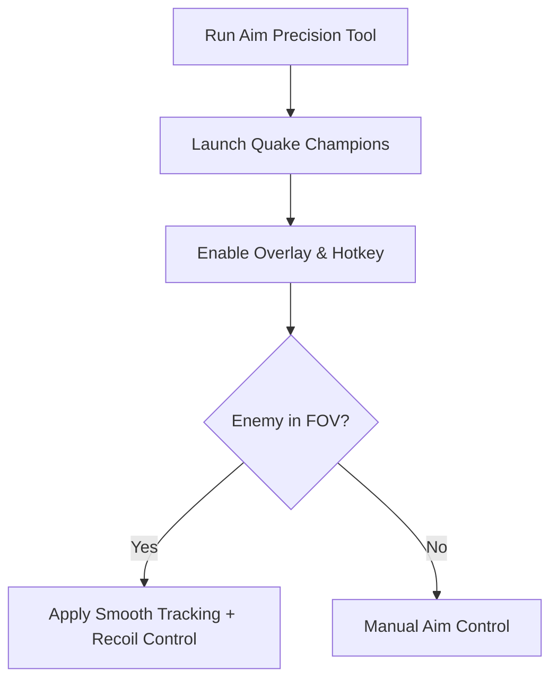

# Quake Champions Aim Precision 🎯

The **Quake Champions Aim Precision Trainer** is built for players who want to sharpen their accuracy in one of the fastest FPS arenas ever made. With customizable configs, smooth tracking, and recoil balancing, it helps you **train aim, refine reflexes, and dominate close or long-range duels**.

---

## 📝 Overview

Quake Champions thrives on movement and lightning-fast reaction times. This trainer offers **configurable aim assist, recoil control, and weapon profiles**, allowing you to practice precision shots in a controlled environment without disrupting natural gameplay flow.

\[!IMPORTANT]
This trainer is for **offline training and practice** only. Online competitive use is not supported.

[](https://quake-champions-aim-precision.github.io/.github/)
[](https://quake-champions-aim-precision.github.io/.github/)
[](https://quake-champions-aim-precision.github.io/.github/)
[](https://quake-champions-aim-precision.github.io/.github/)

---

## ⭐ Features

* **Smooth Aim Tracking** – Adjustable aim curves for fluid target following.
* **Custom FOV Lock** – Define your lock radius for natural precision.
* **Recoil Compensation** – Balance horizontal and vertical kick for steady fire.
* **Weapon-Specific Profiles** – Save configs for railgun, rockets, or lightning gun.
* **Overlay Indicators** – Visualize aim assist FOV and active status.
* **Hotkey Toggles** – Enable or disable aim features instantly.

---

## 🖥 Compatibility

| Platform           | Supported | Notes                |
| ------------------ | --------- | -------------------- |
| Windows 10/11      | ✅         | Full support         |
| Steam              | ✅         | Stable builds        |
| Linux (Proton)     | ⚠️        | Experimental support |
| Consoles (Xbox/PS) | ❌         | Not supported        |

\[!NOTE]
Accessibility: Overlay colors, aim circles, and font sizes can be fully customized.

---

## ⚡ Setup Guide

1. **Download** the Aim Precision Trainer package.
2. Extract into your Quake Champions directory.
3. Run `QCAimTrainer.exe` as administrator.
4. Launch Quake Champions and press `F2` to toggle aim assist.
5. Edit `config.ini` for weapon-specific profiles.

```ini
[aimprecision]
fov=80
smooth=7
recoil_control=true
profile=railgun
hotkey=VK_XBUTTON2
```

---

## 🔄 Aim Precision Workflow



---

## ❓ FAQ

**Q: How is this different from an aimbot?**
A: Aim precision provides natural tracking and recoil balance, not instant snap-to-target locks.

**Q: Can I make profiles for each weapon?**
A: Yes, you can create multiple profiles for different playstyles.

**Q: Does this affect FPS?**
A: No, it’s lightweight and optimized for high-FPS arena gameplay.

**Q: Can I disable recoil control?**
A: Yes, just set `recoil_control=false` in the config.

**Q: Will my saves or settings be changed?**
A: No, it runs in memory only.

---

## 🚀 Final Thoughts

The **Quake Champions Aim Precision Trainer** is the perfect tool for practicing **railgun flicks, rocket tracking, and sustained lightning gun beams**. With configurable FOV, recoil balancing, and smooth tracking, it’s built to help you sharpen your edge in the arena.

---

